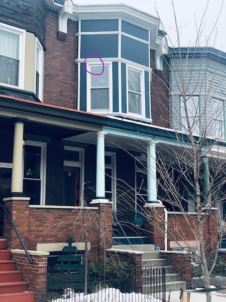
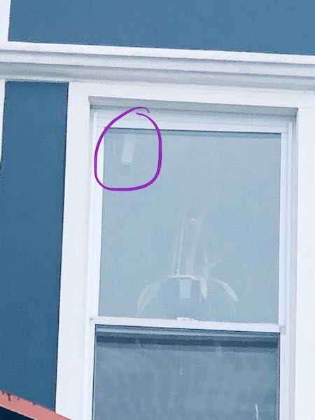
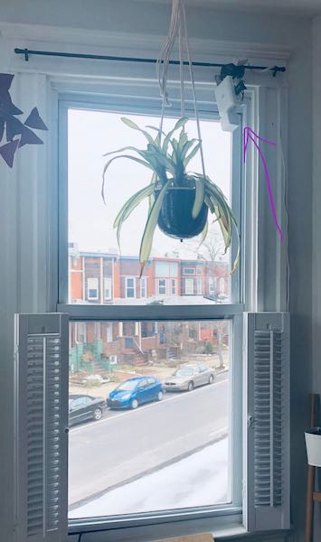
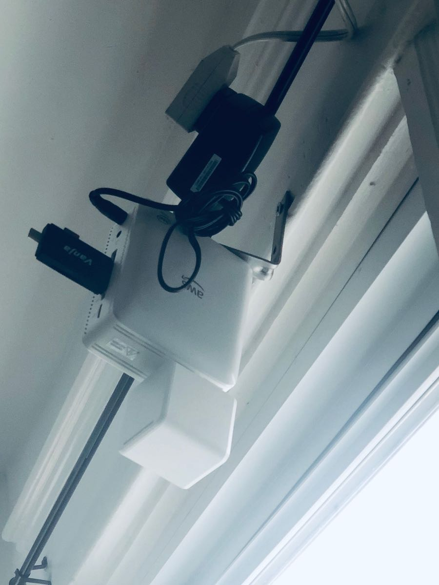

# Speed Camera

I mounted an AWS Deep Lense camera at my house. I'm using this repo to develop a computer vision system for tracking the speed of passing cars.

<table>
    <tr>
        <td></td>
        <td></td>
    </tr>
    <tr>
        <td></td>
        <td></td>
    </tr>
</table>

## setup
```
pip install -r requirements.txt
honcho start
# setup STORAGE_ROOT, hardcoded to /mnt/usb-sd
```

## data model

track ->> regions
frame ->> regions

## Next steps
1. Use tracker to associate sucessive frames
    1. could start by just associating with any track already have and then killing tracks after 5 seconds
2. Compute speed on tracks
3. Post tracks to the rails app when reaped
    ~1. need a worker process to upload reaped tracks~
4. Display tracks
5. Integration test for tracker
    1. Need to collect a bunch of live frames for ground truth. ideally cruise control through the scene

## env suggestions
 * use [pyenv](https://github.com/pyenv/pyenv)
 * `pyenv install` will install the right python from the `.python-version` file
